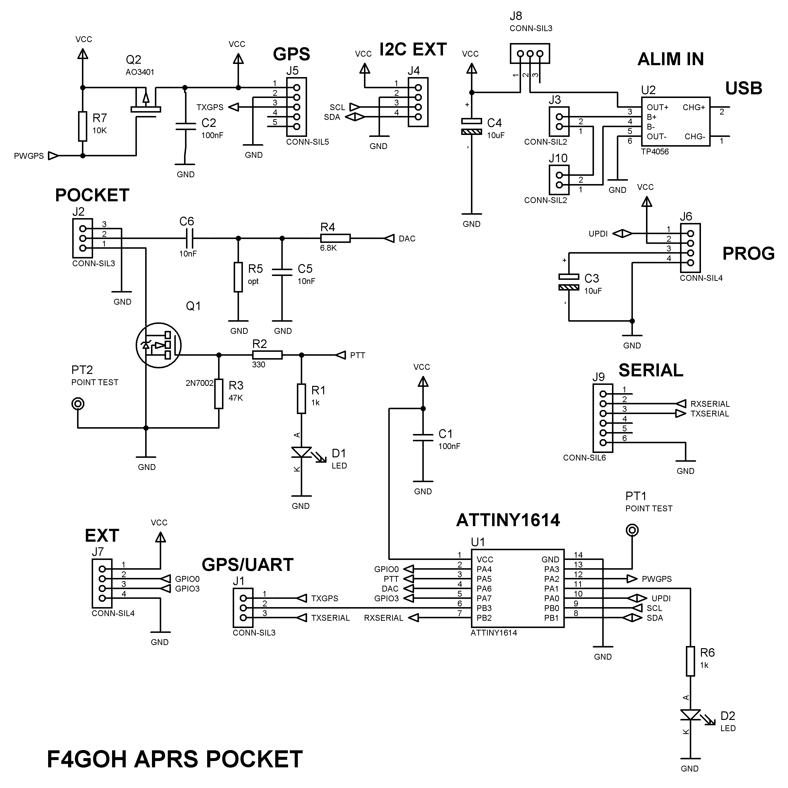
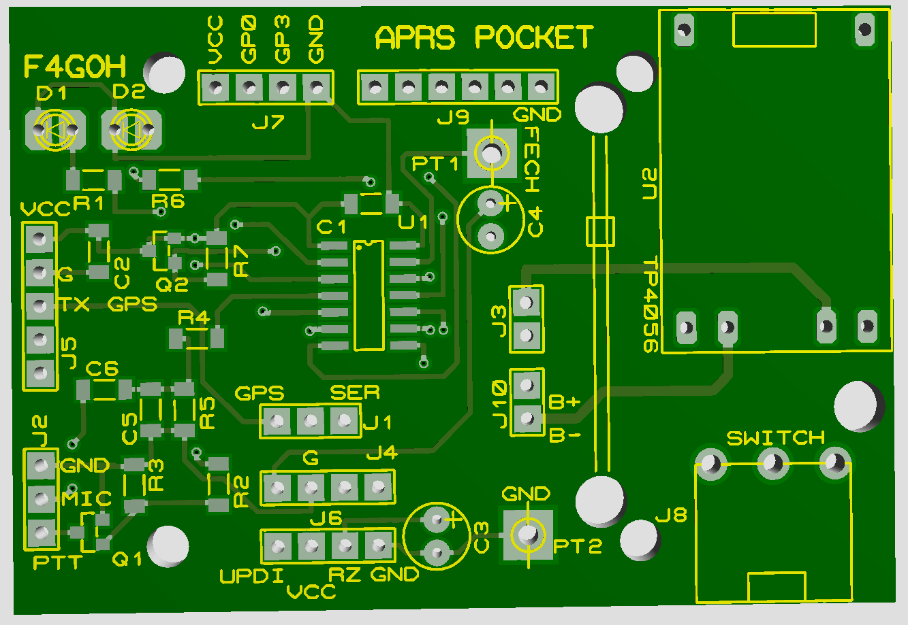
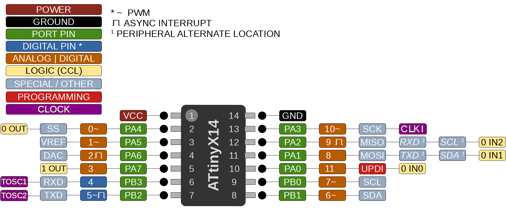
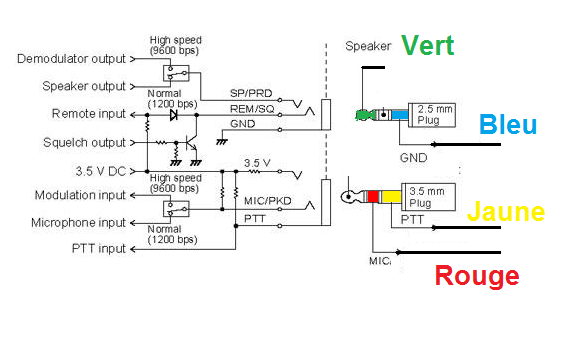
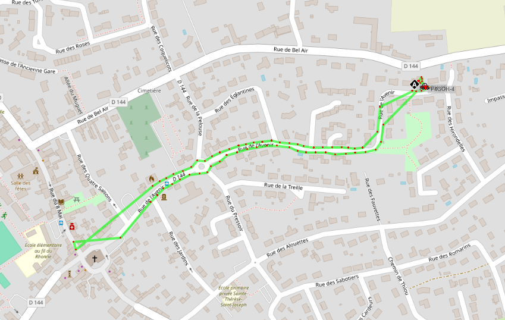
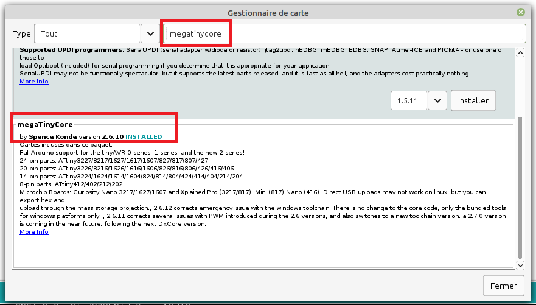
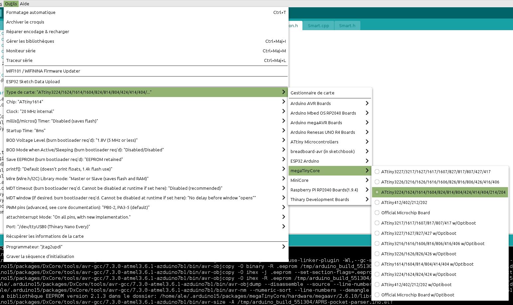
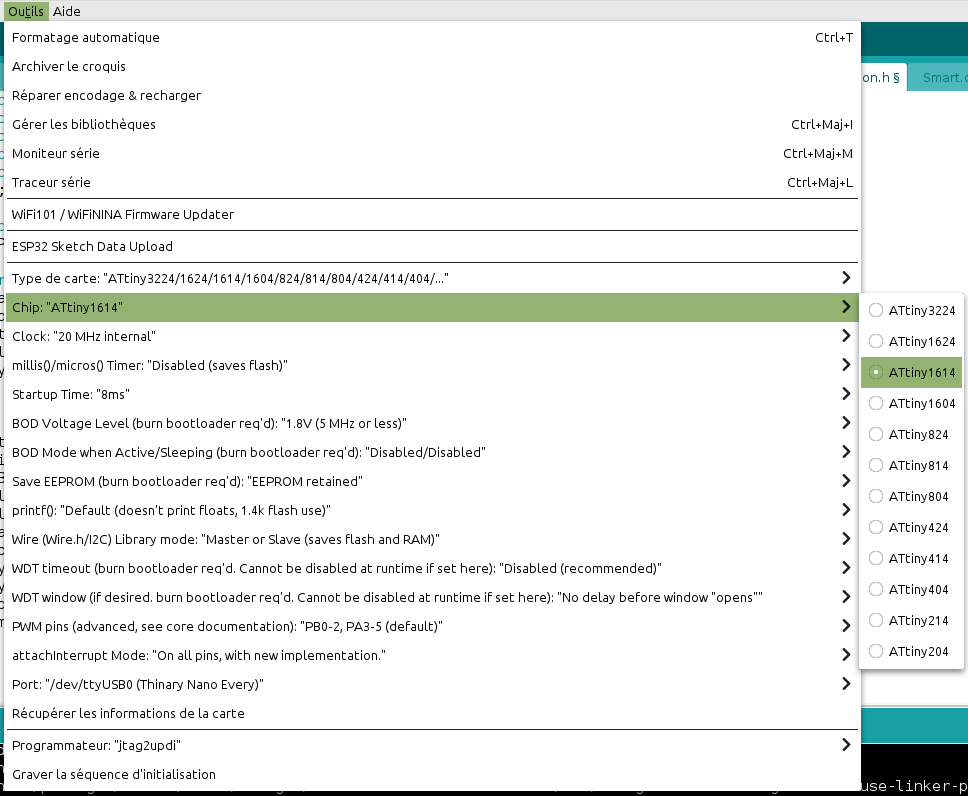
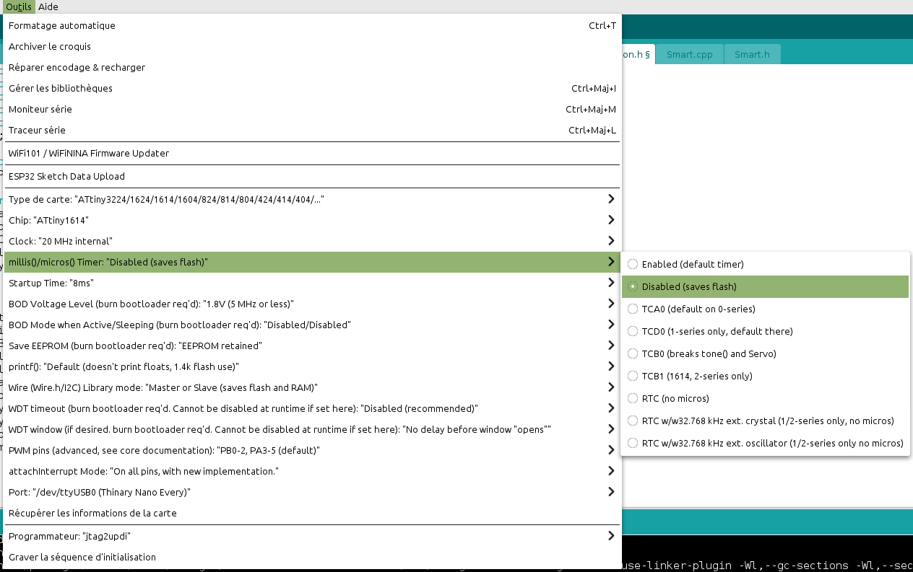
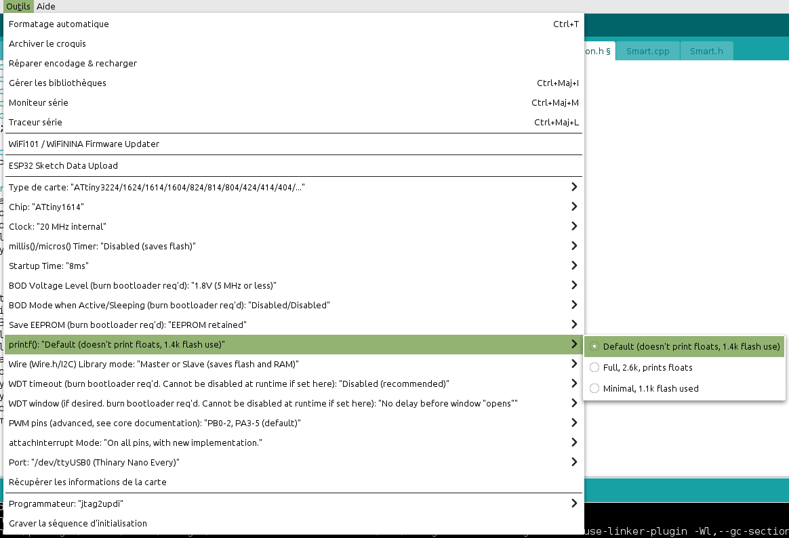

# APRS-pocket

**APRS with ATtiny1614**

The goal is to build a low-cost APRS tracker that fits inside a classic pocket format.  
Tracker configuration is done via serial communication using Google Chrome — no app installation required.

## [APRS POCKET Setup](https://f4goh.github.io/aprs-pocket/)

## Schematic

## PCB

## BOM

| Reference     | Value         | Footprint / Description              | Qty |
|---------------|---------------|--------------------------------------|-----|
| R1,R6         | 1k            | Resistor 1206                        | 2   |
| R2            | 330           | Resistor 1206                        | 1   |
| R3            | 47k           | Resistor 1206                        | 1   |
| R4            | 6.8k          | Resistor 1206                        | 1   |
| R5            | opt           | Resistor 1206                        | 1   |
| R7            | 10k           | Resistor 1206                        | 1   |
| C1,C2,C6      | 100nF         | Capacitor 1206                       | 3   |
| C3,C4         | 10uF          | Capacitor vertical                   | 2   |
| C5            | 10nF          | Capacitor  1206                      | 1   |
| U1            | ATTINY1614    | Integrated Circuit SOIC 14           | 1   |
| U2            | TP4056        | Integrated Circuit module            | 1   |
| Q1            | 2N7002        | Transistor sot23                     | 1   |
| Q2            | AO3401        | Transistor sot23                     | 1   |
| D1,D2         | LED           | Diode                                | 2   |
| J8            | SWITCH        | Switch                               | 1   |
| J1,J2         | CONN-SIL3     | Male          Connector              | 2   |
| J3,J10        | CONN-SIL2     | Male          Connector              | 2   |
| J4            | CONN-SIL4     | Male          Connector              | 1   |
| J5            | CONN-SIL5     | Female Connector                     | 1   |
| J6,J7         | CONN-SIL4     | Male Connector                       | 2   |
| J9            | CONN-SIL6     | Female Connector                     | 1   |
| PT1,PT2       | POINT TEST    | Test Point                           | 2   |

## ATtiny1614 Pinout

### SpMic Pinout (colors depends of source cable)

### Testing Tracker
  

## Programming ATtiny1614 with UPDI and Arduino IDE

To get started with UPDI programming for the ATtiny1614 using the Arduino IDE, follow these steps:

### 1. Install megaTinyCore
Use the Board Manager in Arduino IDE to install the **megaTinyCore** package.  

### 2. Select the ATtiny family
Choose the **ATtiny** family from the board selection menu.  

### 3. Choose ATtiny1614
Pick **ATtiny1614** as your target microcontroller.  

### 4. Disable unnecessary features
To optimize memory usage, disable the following options in the board settings:

- **Remove millis() support**  
  

- **Remove float support in sprintf()**  
  

### 5. Compile APRS-pocket-parser.ino

## Flash the firmware

UPDI (Unified Program and Debug Interface) allows programming ATtiny1614 using just one data pin. You can use a USB-to-Serial adapter with a 4.7kΩ resistor and the megatinycore to upload code via Arduino IDE.

Soon...

## License

**APRS Pocket** by **F4GOH** is licensed under the  
[Creative Commons Attribution-NonCommercial-ShareAlike 4.0 International (CC BY-NC-SA 4.0)](https://creativecommons.org/licenses/by-nc-sa/4.0/)
